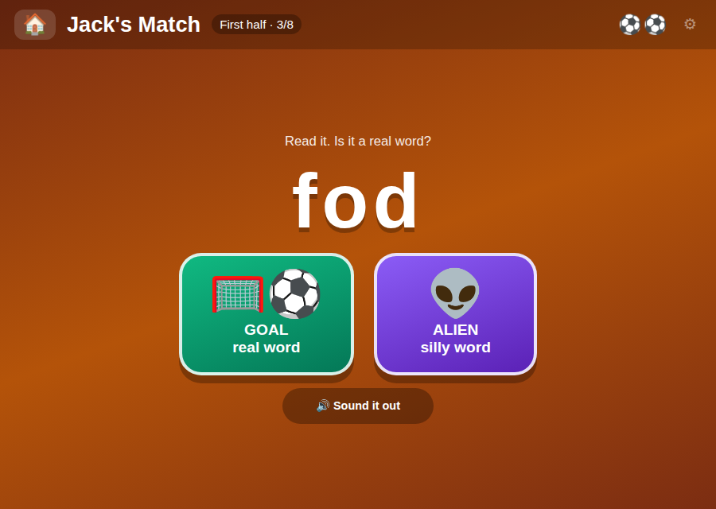
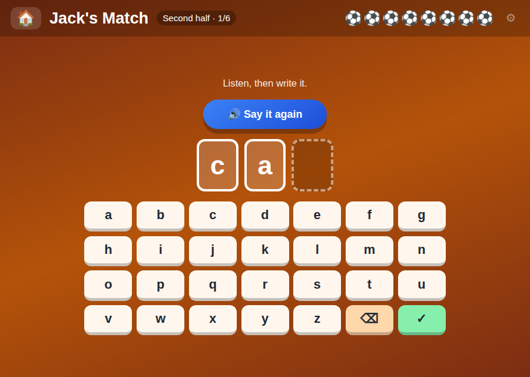

# 🥅 Jack's Match

### Two halves. Read in the first, write in the second. ⚽

# [▶ PLAY](https://jacks-games.github.io/match/)



## ⏱️ First half — real word or alien word?

A word pops up. **Nobody reads it to you.** You read it yourself.

| | |
|---|---|
| 🥅 | It is a **real** word → tap **GOAL** |
| 👽 | It is a **silly** word → tap **ALIEN** |

Silly words are made up, but you can still sound them out: **fod · zat · shob · quog · dree**

Stuck? Tap **🔊 Sound it out**. It says the sounds, never the whole word — that part is yours.

## ⏱️ Second half — write the word



| | |
|---|---|
| 🔊 | Listen to the word |
| ⌨️ | Tap the letters — **no letters are given to you** |
| ✅ | Right letters stay. Wrong ones go away. Try again. |
| ⚽ | Spell it and you score! |

## 🏆 Full time

The whistle goes and you count up your goals. Beat your best next time!

## 🎯 What you get better at

- 🔍 &nbsp; Sounding words out instead of guessing them
- ✍️ &nbsp; Spelling a word from your head
- 🧠 &nbsp; Remembering which letters make which sound

## 🎈 More games for Jack

[📖 Words](https://github.com/jacks-games/words) · [🥅 Match](https://github.com/jacks-games/match) · [✏️ Letters](https://github.com/jacks-games/letters) · [🔢 Numbers](https://github.com/jacks-games/numbers) · [♟️ Chess](https://github.com/jacks-games/chess)

👉 &nbsp; All of them together: **[jackbenn.ing](https://jackbenn.ing)**

---

<details>
<summary><b>For grown-ups</b> — why alien words</summary>

The first half copies the **Year 1 Phonics Screening Check** used in English schools: 40 words, half of them pseudo-words presented as alien names. Nonsense words cannot be recognised by shape or guessed from the first letter, so they show whether a child is really decoding. Every made-up word in here is phonically regular — that is the requirement, not that it sounds funny.

Deliberately, the app does **not** speak the word before the choice. Hearing it first would turn decoding into listening. It speaks the word *after* a correct answer, as confirmation, and sounds it out grapheme by grapheme after a wrong one — `ship` is `sh-i-p`, not `s-h-i-p`, via a digraph-first splitter.

The second half is dictation: no letter tiles, so the grapheme sequence has to come from memory. A wrong attempt keeps the correct prefix and clears the rest; after two attempts a faint ghost word appears.

One self-contained `index.html`, no build step, no dependencies, no accounts, no tracking. Speech is the Web Speech API and starts only after the ▶ tap. Progress lives in `localStorage`. The keyboard is in ABC order by default (a five-year-old hunts in the alphabet, not on a QWERTY layout); a setting switches it.

Source of truth for all of Jack's games is the [jackbenn.ing repo](https://github.com/google814/Jack); this repo is a copy so the game has its own page and link.

```bash
python3 -m http.server 8000
```
</details>
